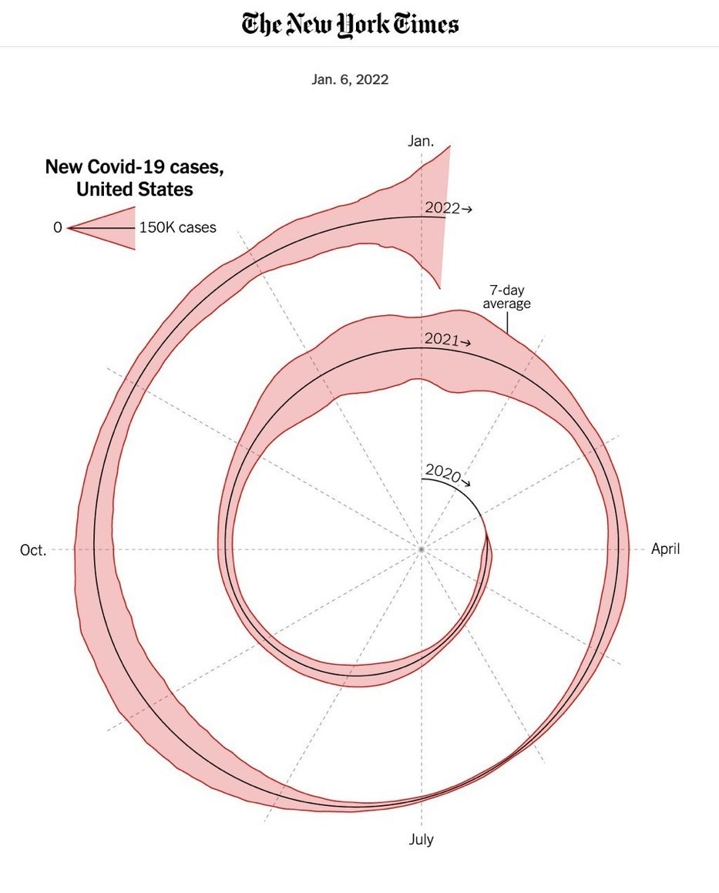

# Assignment 1 - EPPS 6356

## Data Visualization

------------------------------------------------------------------------

### Exercise 1

In his paper (1973), Anscombe claims that visualizing data is crucial for statistical analysis. To support his claim, he presented a dataset that generated four different visualizations in which the data displays totally different behaviors, even though the regression summary was exactly the same for all. That illustrates the fact that only by running statistical/mathematical metrics may not be enough for a scientist to understand the underlying nature of data.

In his paper, Anscombe suggested that data that is not linear could be adjusted by applying transformation functions to the x-axis, to the y-axis or both. Today, with libraries such as the **scikit-learn** library in Python, it is possible to conduct multiple types of transformations not only to linearize data but also to shape the data under several desired statistical distributions.

Thus, using Python is a possible and efficient method I would suggest to go around problems associated with nonlinear data, as addressed by Anscombe.

```{r}
## Anscombe (1973) Quartlet
data(anscombe)  # Load Anscombe's data
View(anscombe) # View the data
summary(anscombe)

## Regression models
lm1 <- lm(y1 ~ x1, data=anscombe)
summary(lm1)
lm2 <- lm(y2 ~ x2, data=anscombe)
summary(lm2)
lm3 <- lm(y3 ~ x3, data=anscombe)
summary(lm3)
lm4 <- lm(y4 ~ x4, data=anscombe)
summary(lm4)

## Plotting the regressions
ff <- y ~ x
mods <- setNames(as.list(1:4), paste0("lm", 1:4))

# Plot using for loop
for(i in 1:4) {
  ff[2:3] <- lapply(paste0(c("y","x"), i), as.name)
  ## or   ff[[2]] <- as.name(paste0("y", i))
  ##      ff[[3]] <- as.name(paste0("x", i))
  mods[[i]] <- lmi <- lm(ff, data = anscombe)
  print(anova(lmi))
}

sapply(mods, coef)  # Note the use of this function
lapply(mods, function(fm) coef(summary(fm)))

# Preparing for the plots
op <- par(mfrow = c(2, 2), mar = 0.1+c(4,4,1,1), oma =  c(0, 0, 2, 0))

# Plot charts using for loop
for(i in 1:4) {
  ff[2:3] <- lapply(paste0(c("y","x"), i), as.name)
  plot(ff, data = anscombe, col = "red", pch = 21, bg = "tomato", cex = 1.2,
       xlim = c(3, 19), ylim = c(3, 13))
  abline(mods[[i]], col = "blue")
}
mtext("Anscombe's 4 Regression data sets", outer = TRUE, cex = 1.5)
par(op)
```

------------------------------------------------------------------------

### Exercise 2

\*Running Fall.R, changing color and publishing

```{r}
## Data Visualization
## Objective: Create graphics with R
## Title: Fall color
# Credit: https://fronkonstin.com

# Install packages
#install.packages(c("gsubfn", "proto", "tidyverse"))

library(gsubfn)
library(tidyverse)

# Define elements in plant art
# Each image corresponds to a different axiom, rules, angle and depth

# Leaf of Fall

axiom="X"
rules=list("X"="F-[[X]+X]+F[+FX]-X", "F"="FF")
angle=22.5
depth=6


for (i in 1:depth) axiom=gsubfn(".", rules, axiom)

actions=str_extract_all(axiom, "\\d*\\+|\\d*\\-|F|L|R|\\[|\\]|\\|") %>% unlist

status=data.frame(x=numeric(0), y=numeric(0), alfa=numeric(0))
points=data.frame(x1 = 0, y1 = 0, x2 = NA, y2 = NA, alfa=90, depth=1)


# Generating data
# Note: may take a minute or two

for (action in actions)
{
  if (action=="F")
  {
    x=points[1, "x1"]+cos(points[1, "alfa"]*(pi/180))
    y=points[1, "y1"]+sin(points[1, "alfa"]*(pi/180))
    points[1,"x2"]=x
    points[1,"y2"]=y
    data.frame(x1 = x, y1 = y, x2 = NA, y2 = NA,
               alfa=points[1, "alfa"],
               depth=points[1,"depth"]) %>% rbind(points)->points
  }
  if (action %in% c("+", "-")){
    alfa=points[1, "alfa"]
    points[1, "alfa"]=eval(parse(text=paste0("alfa",action, angle)))
  }
  if(action=="["){
    data.frame(x=points[1, "x1"], y=points[1, "y1"], alfa=points[1, "alfa"]) %>%
      rbind(status) -> status
    points[1, "depth"]=points[1, "depth"]+1
  }
  
  if(action=="]"){
    depth=points[1, "depth"]
    points[-1,]->points
    data.frame(x1=status[1, "x"], y1=status[1, "y"], x2=NA, y2=NA,
               alfa=status[1, "alfa"],
               depth=depth-1) %>%
      rbind(points) -> points
    status[-1,]->status
  }
}

ggplot() +
  geom_segment(aes(x = x1, y = y1, xend = x2, yend = y2),
               lineend = "round",
               color="tomato", # Set your own Fall: "tomato"
               data=na.omit(points)) +
  coord_fixed(ratio = 1) +
  theme_void() # No grid nor axes
```

------------------------------------------------------------------------

### Exercise 3

\*Write a critique on a chart in published work (book/article/news website)

The following chart was collected from <https://viz.wtf/> and reprdduces a chart published by The New York Times.

The graph is a total mess. First, the timeline is represented as a spiral, which is not natural for humans. A straight timeline on the x-axis, in ascending order would be much more intuitive. Also, the intervals are confusing. The graph shows years, months and days on the same timeline, making it hard to distinguish what the metrics are effectivelly attempting to communicate. The numeric legend is also confusing. The user does not know immediately if the legend intends to be read as a color or as a triangular shape.

{width=70%}
